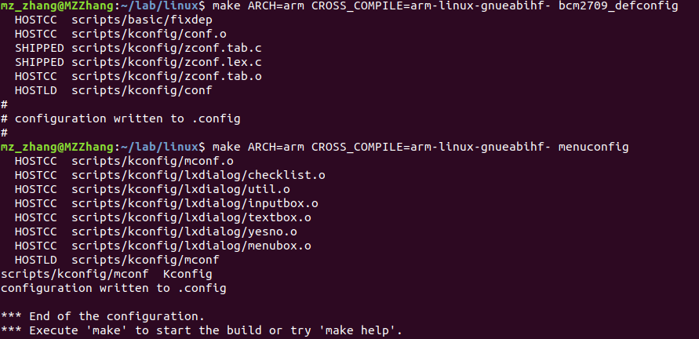
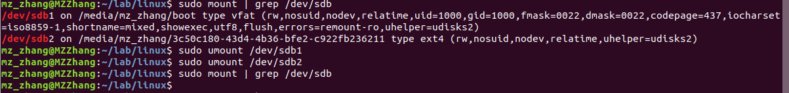
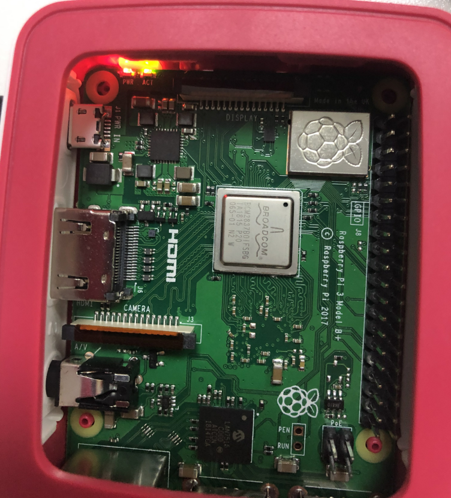

# 利用 Linux 实现 LED 闪烁
#

## 实验记录

完成内核的裁剪后。

若SD卡正在被使用，使用命令`sudo umount /dev/sdb`取消挂载。

在树莓派上启动后led灯闪烁。

## Linux Kernel裁剪
### General setup

#### [*] Kprobes 
用于调试内核。是内核开发者们专门为了便于跟踪内核函数执行状态所设计的一种轻量级内核调试技术。该实验不需要开发内核，可以关闭。

### Enable loadable module support
#### [*] Source checksum for all modules 
为所有的模块校验源码,是为了防止在编译模块时不小心更改了内核模块的源代码但忘记更改版本号而造成版本冲突。该实验中不需要编写内核模块，因此可以关闭。

### Enable the block layer
#### [*] Support for large (2TB+) block devices and files
仅在使用大于2TB的块设备时需要，实验中未用到2TB以上的设备，可以关闭。

### Networking support
led灯闪烁不需要网络支持，可以全部关闭。

## 问题探究
### /dev/sdc1 中除了 kernel7.img 以外的文件哪些是重要的？他们的作用是什么？
bootcode.bin：引导GPU从SD卡上加载start.elf。  
start.elf：允许GPU启动CPU，加载之后的一些文件，如config.txt、cmdline.txt，也会传递一些额外的参数给内核，比如DMA通道，GPU参数，MAC地址，eMMC时钟速度、内核寻址范围等。  
config.txt：配置文件，各种系统配置参数。  
fixup.dat：配置文件，用来设置GPU和CPU之间的sdram分区。  
cmdline.txt：树莓派启动时将所有内核运行参数传递给Linux内核。

### /dev/sdc1 中用到了什么文件系统，为什么？可以换成其他的吗？
使用`sudo fdisk -l /dev/sdb`命令后的输出如下

    设备       启动  起点   末尾  扇区  大小 Id 类型
	/dev/sdb1        8192  98045 89854 43.9M  c W95 FAT32 (LBA)
	/dev/sdb2       98304 118783 20480   10M 83 Linux
由类型一栏可知/dev/sdc1 用到的是FAT32文件系统。  
不可以换成其他的格式，因为用SD卡启动Linux的话，必须是FAT32格式。

### /dev/sdc1 中的 kernel 启动之后为什么会加载 /dev/sdc2 中的 init 程序？
在kernel进入c语言阶段后，会开始执行start_kernel函数，它负责进行kernel正式运行前各个功能的初始化，最后末尾调用了一个rest_init函数启动了三个进程（idle、kernel_init、kthreadd）。init进程由idle通过kernel_thread创建，在内核空间完成初始化后, 加载init程序。它是Linux内核开始建立起进程概念时第一个通过kernel_thread产生的进程，其开始在内核态执行，Linux内核也经历了从内核态到用户态的特权级转变，所有的用户进程都由有该进程派生出来。

### /dev/sdc2 中的 init 正常工作至少需要打开 Linux Kernel 的哪些编译选项？
#### [*] System V IPC
系统的进程间通信Inter Process Communication，它用于处理器在程序之间同步和交换信息，如果不选这项，init程序运行不起来。

### 开机两分钟后，init 程序退出， Linux Kernel 为什么会 panic？
initial程序中频繁使用sleep()函数延时，系统调度会被破坏，造成进程之间的不同步，导致kernel panic。
