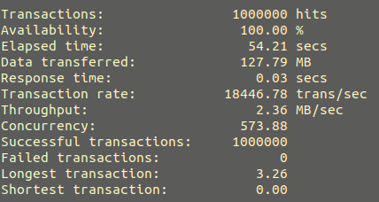
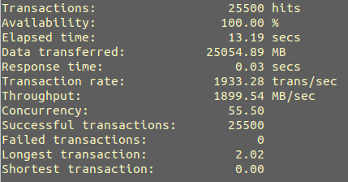

# Lab3 HTTP Server

在示例代码的基础上使用线程池处理请求以提高并发度，对`read()`读取请求进行优化，并考虑不同情况HTTP头的解析。

## 编译运行方法

```
gcc -o server server.c -lpthread
./server
```

## Threadpool

在程序一开始创建MAX_THREAD个线程和长度为MAX_QUEUE的等待队列，每收到一个请求之后将请求入队，如果线程池未满则将队头的请求分配给一个空闲的线程，处理完请求之后线程也不退出，而是继续等待下一个被分配的请求。这样可以大大提高并发度和减小创建线程的开销。

```
while(TRUE)
{
    int clnt_sock = accept(serv_sock, (struct sockaddr*)&clnt_addr, &clnt_addr_size);
    threadpool_addtask(pool, clnt_sock);
}
```

线程池包括以下函数：

```
threadpool_t *threadpool_create(int thread_num, int queue_max_num);//创建线程池

void *threadpool_thread(void *threadpool);//从等待队列的队头取出请求并处理

int threadpool_addtask(threadpool_t *pool, int clnt_sock);//增加请求到等待队列末尾
```

由于程序是个死循环，因此不需要对线程池进行销毁，没有写线程池的销毁函数。

线程池结构体定义：pthread_cond_broadcast(&(pool->queue_not_full));

```
typedef struct
{
    pthread_mutex_t lock;
    pthread_cond_t queue_not_full;
    pthread_cond_t queue_not_empty;

    pthread_t *threads;
    int thread_num;

    int *queue;//使用循环队列
    int queue_num;
    int head;
    int tail;
}threadpool_t;
```

使用线程中的数据时必须先上锁，结束之后再释放。

```
pthread_mutex_lock(&(pool->lock));
……
pthread_mutex_unlock(&(pool->lock));
```

在有入队操作时发送信号

```
pthread_cond_signal(&(pool->queue_not_empty));
```

出队时发送

```
pthread_cond_broadcast(&(pool->queue_not_full));
```

## 读取请求

使用`while(1)`循环进行`read`操作，每次将新读到的字符串和之前的拼接在一起，然后判断字符串后四位是否为`\r\n\r\n`，若符合条件则跳出循环。

```
ssize_t req_len = 0;
while(TRUE)
{
    ssize_t len = read(clnt_sock, buff, MAX_RECV_LEN);
    if(len == 0) break;
    else
    {
        strcat(req_buf, buff);
        req_len = req_len + len;
        if(req_len >= 4 && req_buf[req_len-4] == '\r' && req_buf[req_len-3] == 			'\n' && req_buf[req_len-2] == '\r' && req_buf[req_len-1] == '\n') break;
    }
}
```

## 解析和检验 HTTP 头

首先对请求的内容进行处理，截取出第一个空格之前的字符串与第一、二个空格之间的字符串，然后判断第一个字符串是否为`GET`，若不是直接返回500，再判断路径名的最后一位是否是`/`（即请求是否为文件夹，是文件夹返回500），再将路径名最前面加上字符`.`，之后读文件是是通过相对路径进行读取的，来保证不会跳出程序运行的路径。

## 读取请求资源

用`fopen`打开之前获得的路径上的文件，若打开失败返回404，再用`fseek()`函数获取文件结束的地方，然后计算文件的大小，重置文件指针，再使用`fread()`读取资源。

```
FILE *fp = fopen(filepath, "r");
if(fp)
{
    fseek(fp, 0, SEEK_END);
    filelen = ftell(fp);
    filecontent = (char*) malloc((filelen + 1) * sizeof(char));
    fseek(fp,0,SEEK_SET);
    fread(filecontent, 1, filelen, fp);
    filecontent[filelen] = '\0';
    fclose(fp);
    status = 200;
} 
else status = 404;
```

## 返回资源内容

在读取资源时已经获取了`filecontent`和`filelen`，直接用`write()`函数输出。

## 性能测试

先编辑`siege`的`siege.conf`文件，修改最大并发数为1000。

```
sudo vim /home/mz_zhang/.siege/siege.conf
```

使用大小134字节的文件进行测试，文件放在hello文件夹下，执行命令

```
siege -c 1000 -r 1000 http://127.0.0.1:8000/hello/index.html
```

得到的测试结果如下



再使用大小1M的文件进行测试

```
siege -c 255 -r 100 http://127.0.0.1:8000/hello/index.html
```

结果如下



